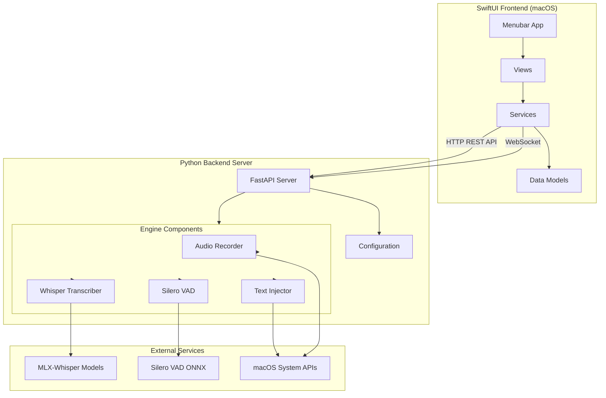
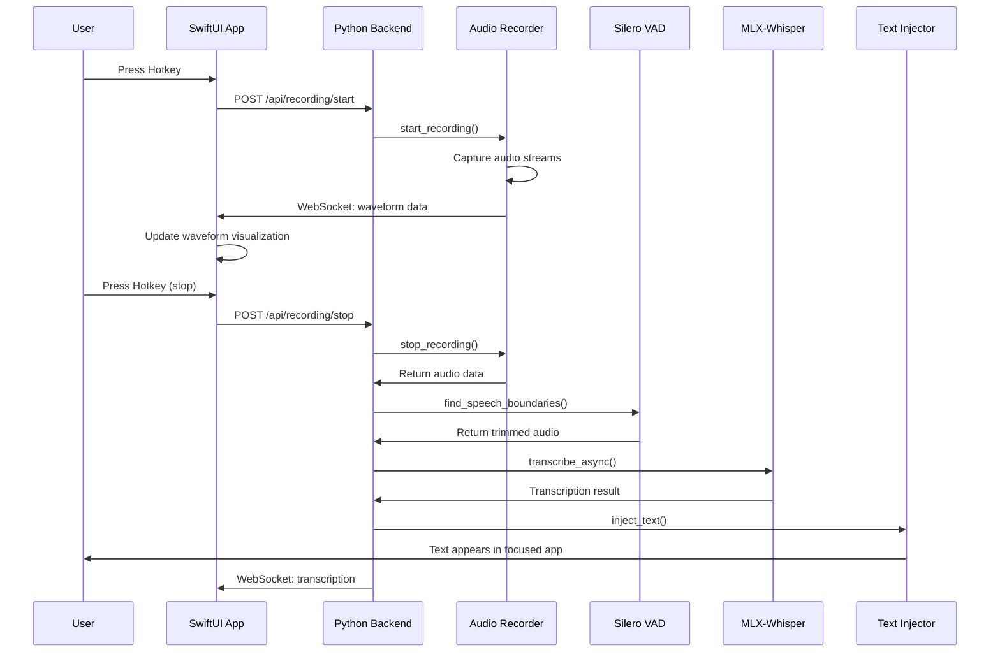
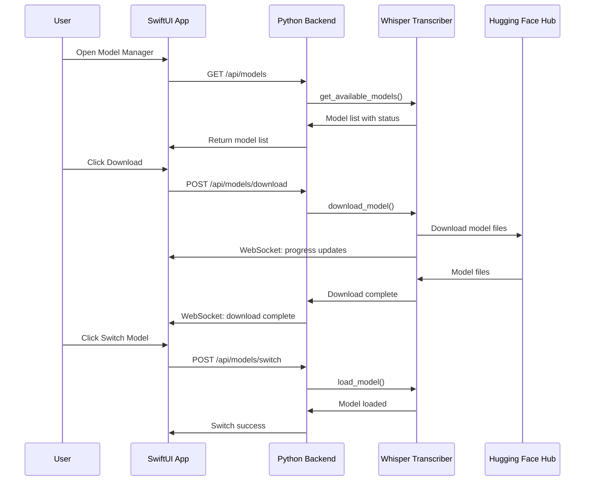
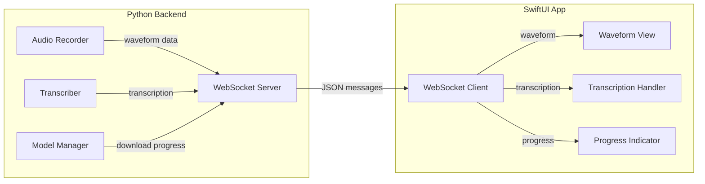

# LocalFlow Architecture

## Overview

LocalFlow is a macOS dictation application with a client-server architecture. The system consists of a native SwiftUI frontend that communicates with a Python backend server via HTTP REST API and WebSocket connections.

## System Architecture

## Component Breakdown

### SwiftUI Frontend

The frontend is a native macOS application that runs in the menu bar.

#### Main Components

- **LocalFlowApp.swift**: Main application entry point with menubar integration
- **Views/**:
  - `RecordingOverlayView.swift`: Recording window with real-time waveform visualization
  - `PreferencesView.swift`: Settings and hotkey configuration UI
  - `ModelManagerView.swift`: Model download and switching interface
- **Services/**:
  - `BackendService.swift`: HTTP client for REST API communication
  - `WebSocketService.swift`: WebSocket client for real-time updates (waveform, transcription, model download progress)
  - `BackendServerManager.swift`: Manages backend server lifecycle
  - `NotificationService.swift`: System notifications
- **Models/**:
  - `DataModels.swift`: Swift data models for API responses

#### Key Features

- Menubar integration (no dock icon)
- Real-time waveform visualization via WebSocket
- Hotkey configuration UI
- Model management interface
- Backend connection status monitoring
- Auto-start backend server option

### Python Backend

The backend is a FastAPI server that handles all audio processing, transcription, and text injection.

#### Main Components

- **server.py**: FastAPI HTTP/WebSocket server
  - REST API endpoints for recording, configuration, and model management
  - WebSocket endpoint for real-time updates
  - CORS middleware for SwiftUI app
- **main.py**: Entry point (can run as CLI app or server mode)
- **config.py**: Configuration management (reads/writes `configs/config.json`)
- **engine/**: Core processing modules
  - `audio.py`: Audio capture and waveform processing
  - `transcriber.py`: MLX-Whisper model loading and inference
  - `vad.py`: Silero VAD for voice activity detection
  - `injector.py`: macOS Accessibility API text injection

#### Key Features

- Dual audio capture (microphone + system audio via BlackHole)
- Real-time waveform data streaming
- Async transcription processing
- VAD-based silence trimming
- Direct text injection (no clipboard)

## Data Flow

### Recording Flow

### Model Management Flow

### WebSocket Real-Time Updates

## Technology Stack

### Frontend Technologies

- **SwiftUI**: Native macOS UI framework
- **AppKit**: macOS system integration (menubar, windows, notifications)
- **Foundation**: Networking (URLSession, WebSocket)
- **Combine**: Reactive programming for state management

### Backend Technologies

- **FastAPI**: Modern Python web framework for REST API and WebSocket
- **Uvicorn**: ASGI server for FastAPI
- **MLX-Whisper**: Metal-accelerated Whisper transcription (Apple Silicon optimized)
- **Silero VAD**: ONNX-based voice activity detection
- **sounddevice**: Audio capture library
- **PyObjC**: macOS Accessibility API integration
- **pynput**: Global hotkey monitoring (legacy CLI mode)

### Audio Processing

- **Sample Rate**: 16kHz (Whisper standard)
- **Format**: Mono, float32
- **Buffer Size**: 1024 samples per buffer
- **Dual Capture**: Microphone + system audio (via BlackHole virtual audio driver)

### Model Management

- **Model Source**: Hugging Face Hub (mlx-community organization)
- **Cache Location**: `~/.cache/local_whisper`
- **Available Variants**: tiny, base, small, medium, large, large-turbo
- **Default Model**: `mlx-community/whisper-large-v3-turbo` (optimized for M4 Pro)

## Communication Protocol

### HTTP REST API

- **Base URL**: `http://127.0.0.1:8000`
- **Protocol**: HTTP/1.1
- **Content-Type**: `application/json`
- **CORS**: Enabled for localhost origins

### WebSocket

- **Endpoint**: `ws://127.0.0.1:8000/ws`
- **Protocol**: WebSocket (RFC 6455)
- **Message Format**: JSON
- **Message Types**:
  - `waveform`: Real-time amplitude data
  - `transcription`: Completed transcription result
  - `model_download_progress`: Model download progress updates
  - `error`: Error messages

## Configuration

Configuration is stored in `configs/config.json` and managed by the `config.py` module. The backend loads configuration on startup and provides endpoints to read and update settings.

See [Configuration Reference](configuration.md) for detailed configuration options.

## Security & Permissions

### Required macOS Permissions

1. **Accessibility**: Required for:
   - Global hotkey monitoring (pynput)
   - Text injection via Accessibility API
   - Focused element detection

2. **Microphone**: Required for audio capture

3. **Notifications** (optional): For user notifications

### Security Considerations

- Backend server runs on localhost only (`127.0.0.1`)
- No external network access required (except for model downloads)
- All processing happens on-device (local-first architecture)
- No data is sent to external services (except Hugging Face for model downloads)

## Performance Characteristics

- **Transcription Speed**: Real-time to 2x real-time (depending on model and hardware)
- **Latency**:
  - Audio capture: < 10ms
  - Transcription: 0.5x to 2x audio duration
  - Text injection: < 50ms
- **Memory Usage**:
  - Base app: ~50MB
  - With large-turbo model: ~4GB
- **CPU Usage**:
  - Idle: < 1%
  - Recording: ~5-10%
  - Transcription: ~50-100% (single core, Metal-accelerated)

## Extension Points

The architecture supports several extension points:

1. **Custom Models**: Add new Whisper model variants via `MODEL_VARIANTS` in `transcriber.py`
2. **Audio Sources**: Extend `AudioRecorder` to support additional audio sources
3. **VAD Alternatives**: Replace Silero VAD with alternative implementations
4. **Injection Methods**: Extend `TextInjector` with additional injection strategies
5. **UI Components**: Add new SwiftUI views for additional features
6. **API Endpoints**: Extend FastAPI server with new endpoints
